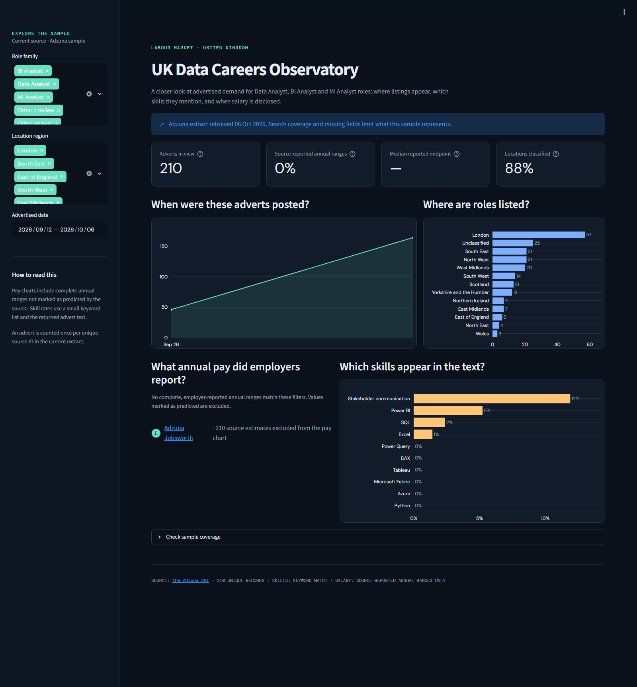

# UK Data Careers Observatory

[](https://github.com/ShabibLiaqat/Uk-job-market-analytics/actions/workflows/refresh-dashboard.yml)

**[Open the interactive dashboard](https://uk-job-market-analytics.streamlit.app/)**

A Python and Streamlit portfolio project exploring UK job adverts returned by Adzuna searches for Data Analyst, Business Intelligence Analyst, and MI Analyst roles. The dashboard compares regional coverage, skill mentions, advertised dates, and usable annual salary ranges while making sampling and missing-data limits visible.



The preview is generated from the committed extract. Its retrieval date is displayed inside the dashboard; it changes after each successful refresh.

## Automated pipeline

Every Monday at **07:17 UTC** (07:17 GMT / 08:17 BST), GitHub Actions:

1. Collects two API pages per search, covering adverts from the last 30 days.
2. Deduplicates posting IDs across searches and validates the new extract before replacing the previous one.
3. Keeps a dated CSV snapshot and rebuilds a SQLite warehouse from all snapshots.
4. Starts Streamlit and uses Playwright to verify the fresh-data date, check chart rendering, and capture the dashboard.
5. Commits the latest CSV, dated snapshot, and screenshot only after those steps succeed.

SQLite is a downloadable workflow artifact retained for 14 days rather than a binary committed on every refresh. The dashboard reads the latest CSV; the warehouse preserves observations across snapshots. Rerunning on the same date replaces that day's snapshot.

The workflow also supports **Actions → Refresh data and dashboard → Run workflow**. Empty API results, invalid data, dashboard errors, and screenshot failures stop publication. API keys are only supplied to the collection step, and descriptions are processed in memory for skill tags then discarded.

## GitHub setup

In **Settings → Secrets and variables → Actions**, add repository secrets named `ADZUNA_APP_ID` and `ADZUNA_APP_KEY`. Never commit `.env` or paste credentials into the workflow. The repository must allow the workflow to write commits to its default branch; branch protection may require a different publication strategy.

The schedule runs on the default branch. GitHub may delay scheduled runs, and schedules in public repositories can be disabled after 60 days without repository activity. Inspect the [workflow history](https://github.com/ShabibLiaqat/Uk-job-market-analytics/actions/workflows/refresh-dashboard.yml) to confirm freshness. See [GitHub scheduling documentation](https://docs.github.com/en/actions/reference/workflows-and-actions/events-that-trigger-workflows#schedule).

## Run locally

Requires Python 3.12.

```powershell
python -m pip install -r requirements.txt
python -m streamlit run app.py
```

The app uses `data/processed/jobs.csv` when available and otherwise clearly labels the fictional sample in `data/sample_jobs.csv`.

To collect data locally, copy `.env.example` to `.env`, fill in your Adzuna credentials, and run:

```powershell
python -m src.collect_adzuna --pages 2 --days 30
python -m src.validate_extract
python -m src.build_warehouse
```

To regenerate the README screenshot:

```powershell
python -m pip install -r requirements-automation.txt
python -m playwright install chromium
python -m src.capture_dashboard
```

## Interactive dashboard hosting

The interactive app is hosted at **[uk-job-market-analytics.streamlit.app](https://uk-job-market-analytics.streamlit.app/)**. Visitors can explore the dashboard in their browser. GitHub Actions updates the data, and Streamlit Community Cloud hosts the app using:

| Setting | Value |
| --- | --- |
| Repository | `ShabibLiaqat/Uk-job-market-analytics` |
| Branch | `main` |
| Main file | `app.py` |
| Python | `3.12` |

The hosted app reads the committed CSV, so it does not need the Adzuna API secrets. Community Cloud applies repository updates after deployment. See [Streamlit deployment documentation](https://docs.streamlit.io/deploy/streamlit-community-cloud/deploy-your-app/deploy) for deployment settings.

## Data model and interpretation

- **Latest extract:** one row per unique source posting ID.
- **Historical snapshots:** one observation per posting ID and retrieval date; repeated appearances are not new jobs.
- **Role classification:** title-based, versioned rules; search-family provenance is stored separately.
- **Skill tags:** dictionary matches in the API's returned description snippet, which is not the full advert.
- **Salary comparison:** complete annual ranges not marked as predicted by Adzuna. Predicted amounts are excluded.
- **Coverage:** a bounded search sample, not a census or a representative estimate of the UK labour market. Changes in snapshots measure changes in returned search results.

Source: [The Adzuna API](https://www.adzuna.co.uk/). Estimates are attributed to [Adzuna Jobsworth](https://www.adzuna.co.uk/jobs/salary-predictor.html) within the dashboard. Initial findings are documented with their original date rather than treated as permanently current.

## Supporting portfolio materials

- [Data dictionary](docs/data-dictionary.md)
- [First live extraction and limitations](docs/initial-extract.md)
- [Portfolio case study](docs/portfolio-story.md)
- [Power BI import queries](powerbi/PowerQuery.md), [model design](powerbi/Model.md), and [DAX measures](powerbi/Measures.dax)
- Original Power BI screenshots remain in `Screenshot/` as supplementary BI work.

## Verification

```powershell
python -m unittest discover -s tests
python -m src.validate_extract
```
